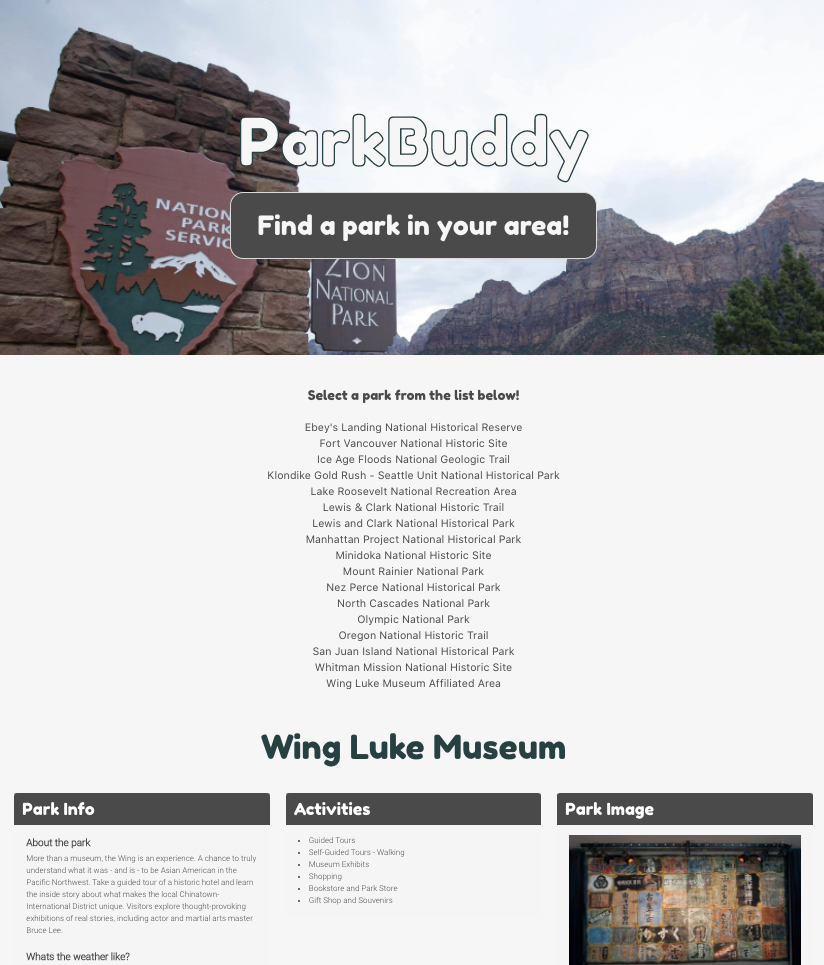
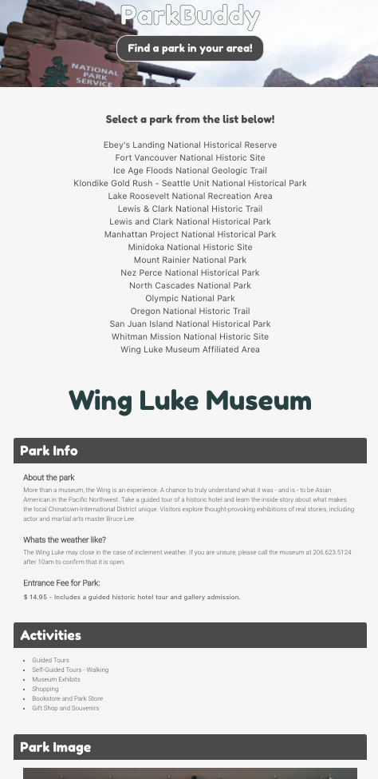

# Park Buddy
## Designed and Built by:
 

#### Caitlin Murphy, David Bushard, Drissa Bagate and Bryan Lara
 

# User Story
 
Our application allows a User to open their device and see the locally ran National Parks and attractions in thier state.
It allows them to see what each park has to offer, how much it may cost to visit that park and the abuilty to get some information and images about that park.
* Who It applies to: Campers/outdoors people searching for spots that are open and able to use at National Parks.

* What we want to accomplish: a site that is easy to use and have an ability to see where national parks are, and if they are open and available to use.

* Future of the application: directions to the park,  directions to park, narrowing down the seach distance of the park and explore parks outside of your state.

Using this website will help the user find basic info about the parks and availability around them.

 

# Tools Used
## HTML
* Bulma Framework

## CSS
* Bulma Framework and Custom CSS

## JavaScript
* Custom

## APIs used  for project
* National Park API
* IPAPI

 

# Key Tasks by Group Members
* Caitlin --- Projection Manager/JavaScript
* Bryan --- Github Wizard/JavaScrpit
* David --- Front End, Design and JavaScript
* Drissa --- API Inspector, Postman and JavaScript

 

# Screenshot

Desktop

Mobile

# Links and Repo

Link to Application
* https://brylara.github.io/Project1/

Repo:
* https://github.com/BRYLARA/Project1

